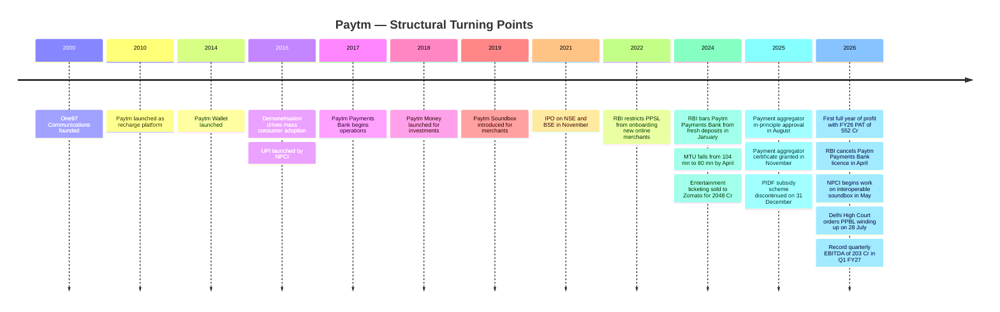
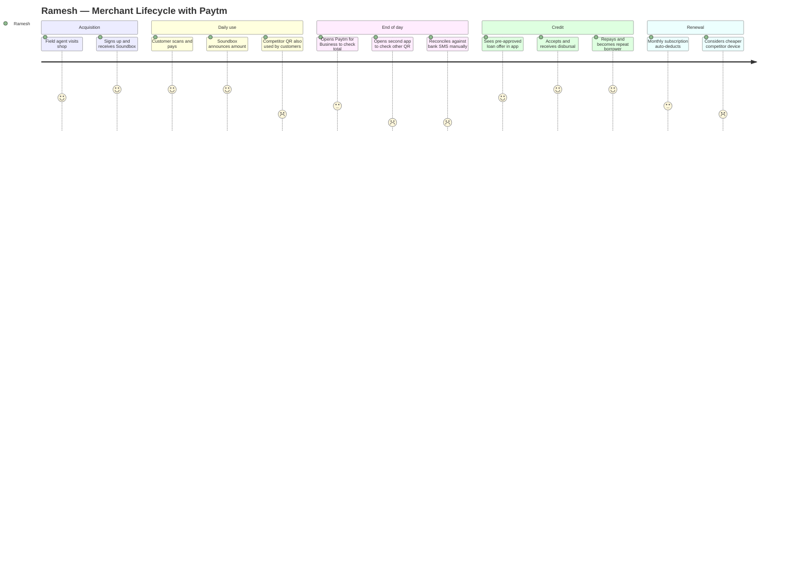
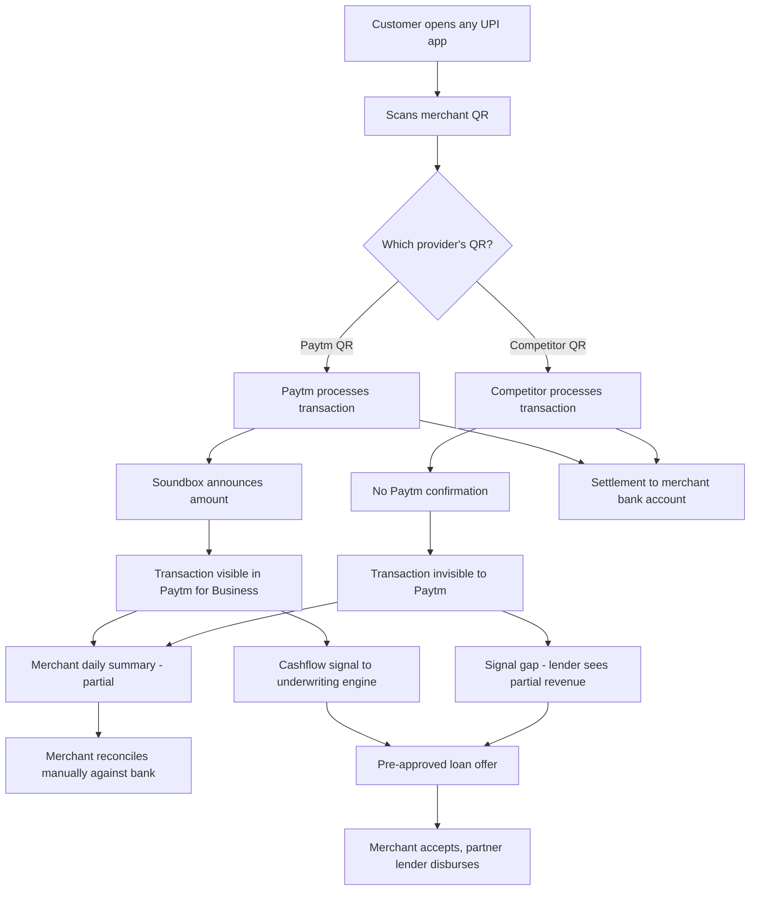
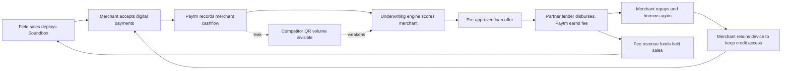
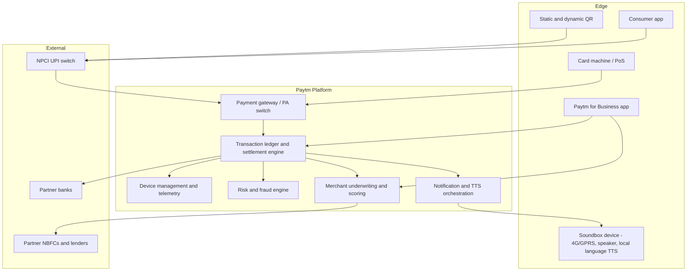
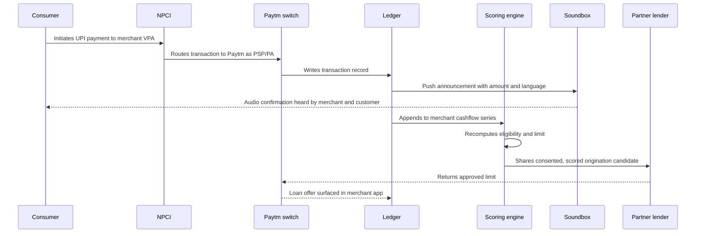
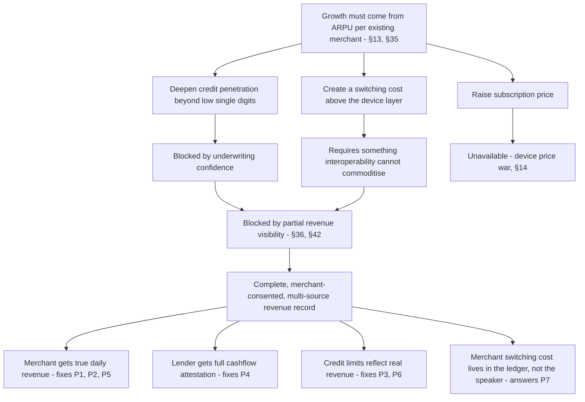
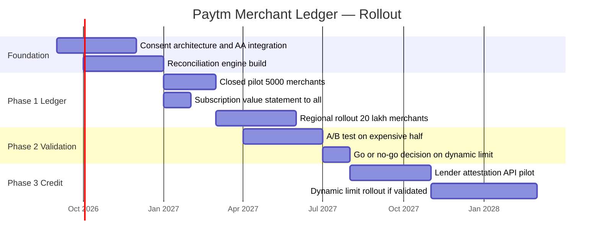

# Paytm — Product Management Case Study

**Day 36 of 90 | PM Case Study Challenge**

---

## 1. Cover

**Product:** Paytm (One97 Communications Ltd — includes Paytm consumer app, Paytm for Business, Paytm Soundbox, Paytm Payments Services Ltd, Paytm Money, Paytm Postpaid)

**Category:** Merchant Payments Infrastructure + Financial Services Distribution

**Author:** Gaurav Singh

**Day:** 36 / 90

**Date Published:** August 1, 2026

---

## 2. Repository Metadata

| Field | Value |
|---|---|
| Repository | product-management-case-studies |
| Folder | `Day-36-Paytm/` |
| Author | Gaurav Singh |
| Series | 90-Day PM Case Study Challenge |
| Previous Day | Day 35 — AppsFlyer |
| Companion file | `ASSUMPTIONS.md` — evidence grades, source conflicts, author-constructed content |
| Newsletter | `NEWSLETTER.md` — condensed essay for LinkedIn Newsletter |
| License | MIT (see §63 License) |

---

## 3. Badges

Day 36/90 · Category: Fintech / Merchant Payments · Ownership: Publicly Listed (NSE/BSE: PAYTM) · HQ: Noida, India · Status: Published

---

## 4. Table of Contents

**Foundations**

1. [Cover](#1-cover)
2. [Repository Metadata](#2-repository-metadata)
3. [Badges](#3-badges)
4. [Table of Contents](#4-table-of-contents)
5. [Executive Summary](#5-executive-summary)
6. [Product Overview](#6-product-overview)
7. [Company Background](#7-company-background)
8. [Product Timeline](#8-product-timeline)
9. [Vision & Mission](#9-vision--mission)
10. [Problem Statement](#10-problem-statement)

**Market & Strategy**

11. [Market Research](#11-market-research)
12. [Industry Analysis](#12-industry-analysis)
13. [TAM/SAM/SOM](#13-tamsamsom)
14. [Competitor Analysis](#14-competitor-analysis)
15. [SWOT](#15-swot)
16. [Porter's Five Forces](#16-porters-five-forces)
17. [Business Model Canvas](#17-business-model-canvas)
18. [Revenue Model](#18-revenue-model)

**Users & Experience**

19. [Target Users](#19-target-users)
20. [Personas](#20-personas)
21. [JTBD](#21-jtbd)
22. [User Journey](#22-user-journey)
23. [User Flow](#23-user-flow)
24. [Information Architecture](#24-information-architecture)
25. [UX Audit](#25-ux-audit)
26. [UI Audit](#26-ui-audit)
27. [Accessibility](#27-accessibility)

**Product & Growth**

28. [Feature Breakdown](#28-feature-breakdown)
29. [AI Capabilities](#29-ai-capabilities)
30. [Product Metrics](#30-product-metrics)
31. [North Star Metric](#31-north-star-metric)
32. [Product Analytics](#32-product-analytics)
33. [AARRR](#33-aarrr)
34. [HEART](#34-heart)
35. [Growth Strategy](#35-growth-strategy)
36. [Growth Loops](#36-growth-loops)
37. [Network Effects](#37-network-effects)
38. [Product Strategy](#38-product-strategy)
39. [Monetization](#39-monetization)
40. [Trust & Safety](#40-trust--safety)

**Technical**

41. [Technical Architecture](#41-technical-architecture)
42. [Data Flow](#42-data-flow)
43. [API Ecosystem](#43-api-ecosystem)
44. [Privacy & Security](#44-privacy--security)

**Opportunity & Proposal**

45. [Pain Points](#45-pain-points)
46. [Opportunity Mapping](#46-opportunity-mapping)
47. [RICE](#47-rice)
48. [MoSCoW](#48-moscow)
49. [Kano](#49-kano)
50. [Feature Proposal](#50-feature-proposal)
51. [PRD](#51-prd)
52. [Wireframes](#52-wireframes)
53. [Rollout Plan](#53-rollout-plan)
54. [A/B Testing](#54-ab-testing)
55. [KPI Dashboard](#55-kpi-dashboard)

**Forward Look**

56. [Product Roadmap](#56-product-roadmap)
57. [Risks & Mitigation](#57-risks--mitigation)
58. [Future Vision](#58-future-vision)

**Closing**

59. [PM Lessons](#59-pm-lessons)
60. [PM Interview Questions](#60-pm-interview-questions)
61. [References](#61-references)
62. [About the Author](#62-about-the-author)
63. [License](#63-license)
64. [Self Review](#64-self-review)
65. [Appendix](#65-appendix)

---

## 5. Executive Summary

**Central thesis: Paytm did not win a payments turnaround. It underwent a forced business-model conversion, and the regulator — not the strategy team — was the one who forced it.**

The convenient story about Paytm in 2026 is a redemption arc: company hit by regulator, company cuts costs, company returns to profit. FY26 closed with operating revenue of ₹8,437 Cr (up 22% YoY), EBITDA of ₹502 Cr (a ₹2,008 Cr YoY swing), and the company's first full year of profit at ₹552 Cr PAT. Q1 FY27, reported on 20 July 2026, extended it: ₹2,448 Cr revenue (+28%), record EBITDA of ₹203 Cr (+182%), PAT ₹220 Cr.

That story is true and uninteresting. The interesting fact sits next to it and appears to contradict it.

In May 2026, NPCI data put Paytm at roughly **7.91% of UPI transaction value** — third place, behind PhonePe at 46.26% and Google Pay at 32.75%. The company that was once synonymous with digital payments in India now moves less than a twelfth of the value on the rail it helped popularise. And it is more profitable than it has ever been.

These two facts are not in tension. They are causally linked.

Consumer UPI in India carries zero MDR. Every incremental consumer UPI transaction Paytm processes is a cost, not a revenue line — it is customer acquisition and engagement expenditure dressed as a payment. Paytm's profit does not come from there. It comes from two places: **1.51 crore merchants paying a monthly subscription for a Soundbox or card machine** (Mar 2026, +27 lakh net YoY), and **fee income from distributing loans and wealth products to those same merchants and their customers** — financial services revenue grew 52% YoY in FY26 to ₹2,593 Cr, the fastest-growing and highest-margin line in the business.

So Paytm's UPI share loss is close to strategically irrelevant to its P&L, and its device installed base is close to strategically decisive.

The uncomfortable second half of the thesis: **Paytm did not choose this shape. It was cut into it.** Before 31 January 2024, Paytm was trying to be a consumer super-app with a captive bank, a lending book, an entertainment ticketing business, and a wallet. The RBI's action against Paytm Payments Bank removed the captive bank, cost the company roughly 24% of its monthly transacting users within three months (104 mn → 80 mn), and forced an asset sale programme — entertainment ticketing went to Zomato for ₹2,048 Cr — that left behind exactly two things: a merchant hardware subscription business and a fee-earning distribution rail. Both are asset-light. Neither carries credit risk. That is why the margins work. The winding-up of Paytm Payments Bank, formally ordered by the Delhi High Court on 28 July 2026, is the closing of a chapter whose destruction created the current business.

This matters because it tells you where the fragility is. A moat you built on purpose you usually know how to defend. Paytm's actual moat is now **an installed base of subscription hardware** — which is not a network effect, does not compound, and can be attacked directly. In May 2026, NPCI began developing an **interoperable soundbox** that would let one device confirm payments from any UPI app. If that ships, the reason a merchant pays Paytm ₹100–150 a month evaporates, and the funnel that feeds the high-margin lending business narrows at the top. Separately, the PIDF subsidy that part-funded device deployment in Tier 3–6 towns was discontinued on 31 December 2025; it had contributed ₹128 Cr in the six months to September 2025.

This case study tests that thesis across all 65 sections, and the feature proposal in §50 follows from it directly: if the device is going to be commoditised, the defensible layer is not the device — it is the merchant's books.

---

## 6. Product Overview

Paytm is best understood not as one product but as three products with very different economics stacked on one distribution base.

| Layer | What it is | Who pays | Economics |
|---|---|---|---|
| Consumer payments app | UPI, wallet, bill pay, recharge, Postpaid | Nobody (zero MDR on UPI P2M for small merchants) | Cost centre / acquisition funnel |
| Merchant acceptance | QR, Soundbox, card machines, PoS, payment gateway | Merchant (₹100–150/month per device, reported range) | Recurring, high-visibility, the profit anchor |
| Financial services distribution | Merchant loans, personal loans, Postpaid, broking, MTF, Paytm Gold | Lending and asset-management partners (distribution fee) | Highest margin, fastest growing, no balance-sheet risk |

The strategic logic runs left to right: the consumer app creates transaction volume, the transaction volume justifies the merchant device, the merchant device generates a verified cashflow record, and the cashflow record is what makes the merchant underwritable by a partner lender. Each layer exists to make the next one possible. The one that makes money is the one on the right.

An important structural detail: since Q1 FY26 Paytm's largest lending partner moved to a **non-DLG** (no default loss guarantee) model, meaning Paytm earns a distribution fee without providing a credit guarantee on those disbursements. This is the single most important line item in understanding why the margin profile changed — Paytm is being paid for origination and servicing, not for taking risk.

---

## 7. Company Background

One97 Communications was founded by Vijay Shekhar Sharma in 2000 as a mobile value-added services company. Paytm launched in 2010 as a recharge platform, became a wallet in 2014, rode demonetisation in 2016 into mass consumer awareness, IPO'd in November 2021 at a valuation that the market spent the following three years repricing, and was then structurally reset by regulatory action in 2024.

The ownership picture is materially different from the IPO-era one. AntFin's exit from the shareholding was a precondition that preceded RBI clearance for the payment aggregator licence — the in-principle approval came on 12 August 2025 and the certificate of authorisation on 26 November 2025, lifting an online merchant onboarding restriction that had been in place since November 2022.

Headcount is approximately 40,000 as of 2026. The FY25 annual report showed average headcount falling from 43,960 (FY24) to 39,368 (FY25), with employee expenses down from ₹3,124 Cr to ₹2,473 Cr — a ₹651 Cr reduction. In June 2026 the company announced a plan to hire roughly 4,000 people into AI-adjacent roles while cutting about 1% of the workforce (~400 roles), which is a reallocation, not an expansion.

Market capitalisation as of 31 July 2026 is reported at **₹86,043.93 Cr** (share price ₹1,343 on NSE); a separate aggregator reported **₹809.12 Bn (~₹80,912 Cr)** for July 2026. Both figures are retained — see §61 and `ASSUMPTIONS.md` for the conflict note.

---

## 8. Product Timeline



The shape of this timeline is the thesis in miniature. Everything from 2010 to 2021 is accumulation — more products, more licences, more balance sheet. Everything from 2022 to 2026 is subtraction. The profit arrives at the end of the subtraction.

---

## 9. Vision & Mission

**Stated positioning (FY25 annual report framing):** "India's Merchants Payments Leader."

That phrasing is itself evidence for the thesis. A company that believed its future was in consumer payments would not lead its annual report with the word "merchants." The public self-description has already been rewritten around the business that survived.

**Mission, as operationalised:** bring India's small merchants into digital payments, and use the resulting transaction record to make them creditworthy to formal lenders.

**Vision, as inferable from capital allocation:** become the operating and credit layer for India's small business, with payments as the acquisition channel rather than the product.

The gap worth noting: Paytm's consumer-facing communication still describes an all-purpose payments app. Its investor communication describes a merchant infrastructure and distribution company. Both are honest; they are addressed to different audiences with different economic relevance.

---

## 10. Problem Statement

**The merchant problem Paytm solves:** A small Indian merchant — a kirana store, a tea stall, a salon — needs to accept digital payments but cannot watch a phone screen while serving customers, cannot afford a card machine, has no accounting system, and cannot borrow from a bank because no institution has any verifiable record of their revenue.

**The three sub-problems, ranked by how much Paytm actually monetises them:**

1. **Payment confirmation without attention** — the merchant needs to know money arrived without looking. This is what the Soundbox solves, and it is what merchants pay for. Monetised directly.
2. **Access to working capital** — the merchant needs ₹30,000 for inventory next week and has no credit history. Monetised at the highest margin, via partner lenders.
3. **Acceptance itself** — the merchant needs a QR code. Monetised at zero, because UPI P2M carries no MDR for small merchants.

Note the inversion: the thing that looks like the core product (acceptance) is free, and the thing that looks like an accessory (an audio speaker) is the paid product. That is not an accident of pricing — it is the entire business model, and it exists because Indian payments regulation removed the ability to charge for the transaction itself.

**The consumer problem, honestly stated:** Paytm solves nothing for consumers that PhonePe and Google Pay do not also solve. Consumer UPI is undifferentiated commodity infrastructure. Paytm's consumer app exists to generate GTV, to keep the brand present, and to funnel users into Postpaid and other credit products where margin exists.

---

## 11. Market Research

**Market context (FY26 / CY2026 data points):**

| Metric | Value | Period |
|---|---|---|
| UPI monthly transaction value | ₹29.90 trillion (record) | May 2026 |
| UPI monthly transaction volume | 23.2 bn | May 2026 |
| UPI monthly volume | 2,264 crore (22.64 bn), all-time high | March 2026 |
| India digital payments market (revenue pool) | USD 7.93 bn | 2026 |
| Paytm merchant GMV | ₹6.5 lakh Cr, +27% YoY | Q4 FY26 |
| Paytm consumer UPI GTV | ₹5.5 lakh Cr, +46% YoY | Q4 FY26 |
| Industry UPI growth rate (comparison base) | 21% | Q4 FY26 |

**The central research finding — merchant multi-homing.** Reporting on the NPCI interoperable soundbox initiative describes the current state plainly: merchants commonly display QR codes from multiple providers (PhonePe, Paytm, BharatPe) and, in the device case, may pay a subscription of roughly ₹100–150 per month *per device*. Merchants multi-home on acceptance but single-home on nothing.

This is the most consequential fact in the entire market analysis, and it cuts both ways. It means Paytm's 1.51 crore subscription merchants are not exclusive — a competitor's QR sits next to Paytm's. It also means merchant reconciliation is genuinely painful, because money arrives into one settlement account from several unrelated providers with no unified record. Hold that second implication; §45, §46 and §50 return to it.

**Framework note:** market sizing below uses a bottom-up merchant-count approach rather than a top-down share of the digital payments revenue pool, because the revenue pool figure (USD 7.93 bn) blends card interchange, gateway fees and wallet economics that are structurally unavailable to Paytm under zero-MDR UPI. Sizing from paying merchants is the only method that reflects what Paytm can actually charge for.

---

## 12. Industry Analysis

Indian merchant payments has an unusual structure: **the transaction layer has been deliberately de-monetised by policy, so all commercial value has migrated to the layers adjacent to it.**

Zero MDR on UPI P2M means no player earns a spread on the dominant payment instrument. The consequences ripple outward:

- **Value migrates to hardware.** If you cannot charge for the transaction, charge for the device that confirms it. Hence the Soundbox category, which barely exists outside India.
- **Value migrates to credit.** If you cannot charge for the transaction, monetise the data it produces. Hence every major Indian payments player becoming a lending distributor.
- **Scale stops implying profit.** PhonePe processes roughly six times Paytm's UPI value and does not earn six times the payments revenue from it, because most of that value is zero-MDR.
- **Regulatory posture becomes a competitive asset.** Licences (payment aggregator, NBFC partnerships) and the absence of restrictions are worth more than incremental market share.

**Consolidation pressure is now inverted.** NPCI's proposed 30% market share cap — currently deferred to 31 December 2026 — is designed to constrain leaders. Paytm at ~7.91% is structurally unaffected by it. The combined PhonePe + Google Pay share fell below 80% for the first time in May 2026, and the top three fell from 95.2% (Jan 2024) to 87% (May 2026), with Navi and super.money together taking ~5.5% and NPCI's own BHIM reaching ~1%. Fragmentation is happening, and it is happening below Paytm as much as above it.

---

## 13. TAM/SAM/SOM

**Framework selection rationale:** TAM/SAM/SOM is used here in its bottom-up unit form (paying merchants × realisable ARPU) rather than its top-down form (share of a reported market size). The top-down approach would be actively misleading for Paytm: the published "India digital payments market" figure of USD 7.93 bn (2026) is dominated by card and gateway economics that zero-MDR UPI has closed off. A bottom-up build from device subscriptions and loan-distribution fees describes revenue Paytm can actually collect. The trade-off is that bottom-up sizing is only as good as its ARPU assumption, which is the weakest input here and is graded accordingly in `ASSUMPTIONS.md`.

**TAM — all Indian merchants who could pay for digital acceptance and credit access.**
India's merchant universe is variously estimated at 60–80 million establishments including unregistered micro-enterprises. Taking a conservative 60 mn addressable merchants at a blended ₹150/month for device subscription gives a device TAM of roughly **₹10,800 Cr/year**. Adding a credit-distribution layer at an assumed ₹500/year of net distribution fee per credit-active merchant across 60 mn gives roughly **₹30,000 Cr/year**. Combined indicative TAM: **~₹40,000 Cr/year**. Every input here is author-constructed except the ₹150 subscription anchor.

**SAM — merchants reachable by Paytm's current sales, service and language footprint.**
Paytm's device business is concentrated in towns where field servicing is economic. Assume 25 mn merchants are practically serviceable at current cost structures. Device SAM ≈ **₹4,500 Cr/year**; credit distribution SAM ≈ **₹12,500 Cr/year**. Combined SAM: **~₹17,000 Cr/year**.

**SOM — what Paytm currently holds.**
Actual FY26 operating revenue: **₹8,437 Cr**, of which financial services distribution was **₹2,593 Cr**. Subscription merchants: **1.51 crore**. Against the SAM above, Paytm holds roughly half of its own serviceable market by revenue — which is the real headline. The constraint on Paytm is not that the market is small; it is that Paytm has already taken a large share of the part of the market it can economically serve. **Growth must therefore come from ARPU expansion per existing merchant, not merchant count.** This conclusion feeds §46 and §50 directly.

---

## 14. Competitor Analysis

| Player | UPI value share (May 2026) | Merchant device position | Structural advantage | Structural weakness |
|---|---|---|---|---|
| **PhonePe** | 46.26% | 2–2.5 mn soundboxes deployed | Overwhelming consumer scale; IPO opened 25 July 2026 (OFS, target valuation reported $12–15 bn) | Faces the 30% cap; consumer scale is zero-MDR volume |
| **Google Pay** | 32.75% | Limited device presence | Distribution via Android; low cost to serve | No merchant hardware moat; faces the cap |
| **Paytm** | 7.91% | 1.51 crore subscription merchants | Largest paid device installed base; full payment aggregator licence; distribution rails to lenders | Consumer share small and shrinking; device moat attackable |
| **Pine Labs** | n/a | Dominant in PoS terminals; IPO'd with ₹2,080 Cr fresh issue | Enterprise and large-merchant relationships | Weak in micro-merchant segment |
| **BharatPe** | n/a | Major soundbox incumbent | Merchant-first from inception | Smaller consumer funnel |
| **Navi + super.money** | ~5.5% combined | Minimal | Capital-backed consumer growth | No merchant monetisation layer yet |
| **BHIM (NPCI)** | ~1% | n/a | Regulator-adjacent | Not commercially motivated |

**The comparison that matters.** Paytm has roughly one-sixth of PhonePe's UPI value share and roughly six times PhonePe's paid device base (1.51 crore vs 2–2.5 mn deployed soundboxes). Those two ratios, side by side, are the clearest single expression of the thesis: the two companies are not competing on the same axis. PhonePe is winning consumer transaction share; Paytm is winning merchant subscription revenue.

**The competitive event to watch is not PhonePe's IPO. It is NPCI's interoperable soundbox.** PhonePe raising capital lets it subsidise devices harder — painful but survivable, since Paytm has survived exactly that since 2024. NPCI making one device work with all apps removes the *reason* for the subscription, which is different in kind. It converts Paytm's largest asset from a moat into a depreciating hardware fleet.

---

## 15. SWOT

**Strengths**
- 1.51 crore paying subscription merchants — the largest recurring-revenue merchant base in Indian fintech, +27 lakh net YoY.
- Full payment aggregator licence (Nov 2025), removing a three-year onboarding constraint.
- Financial services distribution growing 52% YoY (FY26, ₹2,593 Cr) with no balance-sheet credit risk on the largest partner's book (non-DLG since Q1 FY26).
- Demonstrated cost discipline: employee expense down ₹651 Cr FY24→FY25; marketing spend cut 65% YoY in Q1 FY26.
- Contribution margin of 55% in Q4 FY26.

**Weaknesses**
- Consumer UPI share of ~7.91% by value, far behind PhonePe and Google Pay.
- The core paid product is a physical device with field servicing costs and hardware depreciation.
- Subscription pricing is disclosed only as a reported range (₹100–150/month); merchant churn is **not disclosed**, which makes the durability of the base unverifiable from outside.
- Brand still carries the 2024 regulatory episode in consumer memory.

**Opportunities**
- ARPU expansion within the existing 1.51 crore base — the SOM analysis in §13 shows this is where headroom actually is.
- Key financial services customers grew only from 5.5 lakh to 7.5 lakh — against 1.51 crore subscription merchants, credit penetration is in the low single digits. This is the largest unexploited gap in the business.
- Repeat borrowers already >50% of disbursements, indicating the product works once adopted.
- Merchant reconciliation across multiple QR providers is an unserved, high-frequency pain (see §45).

**Threats**
- NPCI interoperable soundbox (in development since May 2026) directly attacks subscription lock-in.
- PIDF discontinuation (31 Dec 2025; ₹128 Cr over the six months to Sep 2025) removes a device-deployment subsidy in exactly the Tier 3–6 markets where incremental merchants live.
- PhonePe post-IPO capital enabling deeper device subsidy.
- Lending partner concentration — a shift by the largest partner (as already occurred on DLG terms) can move economics materially.

---

## 16. Porter's Five Forces

**Framework selection rationale:** Porter's is used here specifically because Paytm's industry has an unusual property — the buyer (merchant) multi-homes cheaply while the supplier (NPCI/regulator) sets prices to zero by fiat. Porter's separates those two pressures cleanly, where a simple competitive-landscape map would blur them into "competition is intense." The limitation is that Porter's assumes a stable industry boundary, and Indian payments boundaries are redrawn by regulation on a roughly annual basis; the analysis below is therefore point-in-time as of August 2026.

| Force | Intensity | Reasoning |
|---|---|---|
| **Threat of new entrants** | **Moderate** | Software entry is easy (Navi and super.money took 5.5% quickly). Physical device distribution across 1.51 crore merchants is genuinely hard to replicate — field sales, servicing, and replacement logistics. The barrier is logistical, not technological. |
| **Bargaining power of buyers (merchants)** | **High and rising** | Merchants already display competing QR codes. Switching cost is one month's subscription. Interoperable soundbox would push this to very high. |
| **Bargaining power of suppliers** | **High** | Two supplier classes dominate: NPCI/RBI, who set MDR to zero and can mandate interoperability; and lending partners, who own the balance sheet and can renegotiate DLG terms — as the largest partner did in Q1 FY26. |
| **Threat of substitutes** | **Moderate** | Bank-issued soundboxes and QR are direct substitutes. Cash remains a substitute at the very bottom of the market. |
| **Competitive rivalry** | **High** | PhonePe, BharatPe, Pine Labs and banks all compete on device subsidy, which is a price war in hardware. |

**Reading across the forces:** four of five point at the same vulnerability — the merchant relationship is cheap to exit and the pricing power sits with the regulator. Paytm's only genuinely durable position is the one force where it scores well: the logistical barrier to replicating a 1.51 crore field-serviced installed base. A strategy that does not deepen switching costs *above* the device layer leaves the company defending its weakest force with its only strong one.

---

## 17. Business Model Canvas

| Block | Content |
|---|---|
| **Customer segments** | Micro and small merchants (primary, paying); mid-market and online merchants (via PA licence); consumers (non-paying funnel); lending and AMC partners (revenue-paying counterparties) |
| **Value propositions** | Merchant: instant audio confirmation, unified acceptance, access to working capital. Consumer: payments, bill pay, Postpaid credit, investing. Lender: pre-qualified, cashflow-verified borrower origination at low CAC |
| **Channels** | Field sales force; Paytm for Business app; consumer app; partner bank and NBFC channels; online merchant onboarding (restored Nov 2025) |
| **Customer relationships** | Subscription-based and field-serviced for merchants; self-serve for consumers; contractual for lending partners |
| **Revenue streams** | Device subscriptions; payment processing margin; financial services distribution fees; broking, MTF and wealth revenue; other operating income |
| **Key resources** | 1.51 crore device installed base; payment aggregator licence; merchant transaction data; ~40,000 employees; lender relationships |
| **Key activities** | Device deployment and servicing; payment processing; risk and fraud management; loan origination and collections support; AI-driven personalisation |
| **Key partners** | NPCI; partner banks; NBFCs and lenders; device manufacturers; AMCs |
| **Cost structure** | Payment processing and network costs; device COGS and depreciation; field sales and servicing; employee expense (₹2,473 Cr FY25); marketing (cut 65% YoY in Q1 FY26) |

The canvas exposes something the P&L hides: **Paytm's paying customer and its revenue-paying counterparty are different entities.** The merchant pays a small subscription; the lender pays the meaningful fee. Paytm's real customer, in revenue terms, is increasingly the lender — and the merchant is the inventory.

---

## 18. Revenue Model

**FY26 reported structure:**

| Line | FY26 | Growth | Character |
|---|---|---|---|
| Total operating revenue | ₹8,437 Cr | +22% YoY | — |
| Financial services distribution | ₹2,593 Cr | +52% YoY | Fee-based, asset-light, highest margin |
| Payments + merchant (residual) | ~₹5,844 Cr | implied | Subscription + processing margin |
| EBITDA | ₹502 Cr | +₹2,008 Cr YoY | First meaningfully positive year |
| PAT | ₹552 Cr | vs ₹663 Cr loss in FY25 | First full-year profit |

**Q4 FY26:** revenue ₹2,264 Cr (+18% reported, +26% on a comparable basis), EBITDA ₹132 Cr, PAT ₹183 Cr, contribution profit ₹1,254 Cr at 55% margin, financial services ₹750 Cr (+38%).

**Q1 FY27 (announced 20 July 2026):** revenue ₹2,448 Cr (+28%), EBITDA ₹203 Cr (+182%, 8% margin), PAT ₹220 Cr. Adjusting for PIDF discontinuation, revenue growth would have been 31%.

**Three observations that matter more than the totals:**

1. **Financial services is growing at 2.4x the rate of the company.** At 52% vs 22%, the mix is shifting quickly. If both rates hold, financial services becomes the largest single line within roughly three years — at which point Paytm is a lending distributor with a payments division, not the reverse.

2. **PAT exceeds EBITDA in FY26** (₹552 Cr vs ₹502 Cr), which points to material non-operating income. Q1 FY26 commentary explicitly cited "higher other income" as a contributor to profitability. The operating business is profitable but less profitable than the headline PAT implies, and readers should treat the EBITDA line as the truer measure of the core.

3. **PIDF was load-bearing at the margin.** The 28% vs 31% growth gap in Q1 FY27 is the visible cost of the subsidy ending. Paytm's own guidance is that it expects to "significantly offset the impact over time through a combination of higher revenues and more targeted sales efforts" — which is an honest way of saying it will deploy fewer devices in the least economic districts.

---

## 19. Target Users

**Segment A — Subscription merchant (the paying customer, 1.51 crore).**
Micro to small retail: kirana, chemist, tea stall, salon, auto parts, hardware. Daily transaction count in the tens to low hundreds. Owner-operated. Smartphone-literate but not app-native. Cares about: did the money arrive, how much came in today, can I borrow before the festival season.

**Segment B — Consumer transactor (7.7 crore MTU, +50 lakh YoY).**
Uses Paytm for UPI, bills, recharges, and increasingly Postpaid. Multi-homes across two or three payment apps. Non-paying, but the funnel for consumer credit and wealth products.

**Segment C — Financial services customer (7.5 lakh key FS customers, +36% YoY).**
The commercially decisive segment. Merchants and consumers who have taken a loan, opened a broking account, or hold Postpaid. Repeat borrowers are >50% of disbursements — retention within this cohort is strong.

**The number to stare at:** 7.5 lakh key financial services customers against 1.51 crore subscription merchants. Even allowing that not all FS customers are merchants and not all merchants are credit-eligible, credit penetration into the paid merchant base is in the **low single digits**. Paytm has already acquired the hardest thing to acquire — a paying, verified, cashflow-visible small business — and has monetised it at the highest-margin layer for only a small fraction of the base. §46 treats this as the primary opportunity.

---

## 20. Personas

**Persona 1 — Ramesh, 44, kirana owner, Tier-2 town (Segment A)**
Runs a 300 sq ft grocery. Roughly 120 transactions a day, average ticket ₹180. Has a Paytm Soundbox and a PhonePe QR taped next to it. Pays ~₹150/month for the Soundbox and considers it worth it because he can hear confirmation while weighing goods. Settles into a current account and reconciles by scrolling two apps and a bank SMS thread at 10pm. Took a ₹60,000 merchant loan before Diwali and repaid it; would take another. *Frustration:* he cannot tell, without manual effort, how much he actually took in across both QR codes.

**Persona 2 — Sunita, 29, salon owner, metro (Segment A / C)**
Six chairs, four staff. Uses a Soundbox and a card machine. Books appointments on WhatsApp. Wants to open a second location and needs ₹4 lakh. Has no ITR history that satisfies a bank. *Frustration:* every lender asks for documentation of revenue she can only prove through screenshots.

**Persona 3 — Arjun, 26, salaried, metro (Segment B)**
Uses Google Pay by default and Paytm for bill payments, movie-adjacent transactions, and Postpaid when short before payday. Has no loyalty to any app. *Frustration:* none worth solving; he is not the business.

**Persona 4 — Meera, 38, credit risk lead at a partner NBFC (revenue counterparty)**
Buys originated merchant loans from Paytm. Cares about vintage performance, verified cashflow inputs, and the cost of acquiring a borrower she cannot otherwise reach. *Frustration:* the cashflow signal she receives reflects only Paytm-processed volume, so she is underwriting on a partial view of the merchant's revenue.

Persona 4 is the one most PM analyses of Paytm omit, and she is the one whose satisfaction determines the highest-margin revenue line. Her frustration — a partial cashflow view — is the same underlying defect as Ramesh's and Sunita's. Three of four personas are blocked by the same thing: **nobody, including Paytm, sees the merchant's whole revenue.**

---

## 21. JTBD

| Job | Who | Current solution | Where it fails |
|---|---|---|---|
| "When a customer pays, tell me it arrived without me looking up" | Ramesh | Paytm Soundbox | Works. This is the job Paytm nails, and the reason the subscription is paid |
| "At end of day, tell me what I actually earned across every way people paid me" | Ramesh, Sunita | Manual — two apps plus bank SMS | Fails completely. No provider aggregates across competitors |
| "When I need inventory money before a festival, get it to me in a day without paperwork" | Sunita | Paytm merchant loan | Works well when offered; offered to a small fraction of the base |
| "Prove to a lender that my business earns what I say it earns" | Sunita | Screenshots, informal | Fails. No portable, verified revenue record exists |
| "Let me acquire a merchant borrower I could not otherwise reach, with a cashflow signal I trust" | Meera (NBFC) | Paytm origination | Partially works — signal covers only Paytm-processed volume |
| "Pay for something quickly" | Arjun | Any UPI app | Solved by everyone; not monetisable |

The jobs cluster into two groups: **the confirmation job**, which Paytm has solved and monetised, and **the visibility job** — knowing and proving total revenue — which no player has solved and which blocks both the merchant and the lender simultaneously.

---

## 22. User Journey



The journey has one deep trough and it is not where product teams usually look. Payment acceptance scores well. Credit scores well. **End-of-day reconciliation is the floor of the entire experience**, and it is also the moment immediately before the merchant evaluates whether the subscription is worth renewing.

---

## 23. User Flow



Node J and node N are the structural defect. Every rupee a merchant takes through a competitor's QR is simultaneously invisible in the merchant's own summary and absent from the underwriting signal. The same missing data damages the customer experience and the revenue engine.

---

## 24. Information Architecture

**Paytm for Business (merchant app) — top level:**
- Home — today's collections, device status
- Payments — transaction list, settlements, QR management
- Business Loans — offers, active loans, repayment schedule
- Devices — Soundbox and card machine management, subscription status
- Reports — statements and downloads
- Help

**Paytm consumer app — top level:**
- Home — scan, pay, balance, shortcuts
- UPI and wallet
- Recharge and bills
- Loans and credit (Postpaid, personal loan)
- Wealth (Money, Gold, broking, MTF)
- Profile and settings

**IA observation.** The merchant app's IA is organised around *Paytm's products* (Payments, Loans, Devices) rather than around *the merchant's questions* (What did I earn? Can I borrow? Is my device working?). "Reports" being a separate tab from "Home" is a small tell: the summary the merchant most wants is architecturally treated as an export rather than a primary surface. The consumer app has the opposite problem — breadth from the super-app era persists in an app whose economics now rest on credit and wealth.

---

## 25. UX Audit

| Area | Assessment | Evidence basis |
|---|---|---|
| Payment confirmation | Excellent — audio confirmation is the category-defining UX innovation and works for non-literate and distracted users | Product design, widely reported adoption |
| Merchant onboarding | Strong — field-assisted, minimal self-service burden | Field model, 27 lakh net additions FY26 |
| Daily reconciliation | Weak — single-provider view only; merchant must leave the app to complete the job | Author assessment based on multi-homing behaviour reported in market coverage |
| Loan discovery | Good — pre-approved offers surfaced in-app; repeat borrowing >50% of disbursements suggests low friction | Q4 FY26 disclosure |
| Device management | Adequate — subscription status visible, but value received is not made visible alongside cost | Author assessment |
| Consumer app density | Cluttered — retains super-app breadth without super-app usage | Author assessment |

**The single most valuable UX observation:** the merchant sees the ₹150 monthly debit clearly, and never sees a quantified statement of what the device delivered. A subscription that shows its price but not its value is renegotiated at every price comparison. This is a cheap fix with direct retention consequences and it recurs in §50.

---

## 26. UI Audit

- **Paytm for Business** uses a data-forward layout with a large collections figure on home. Good hierarchy for the primary question. Colour coding for settled vs pending is functional.
- **Soundbox hardware UI** is essentially a single output channel (audio) with a small display on newer models. Constraint-driven and correct: the merchant's hands and eyes are busy.
- **Consumer app** carries high visual density — grids of service tiles inherited from the super-app period. Newer credit and wealth surfaces are cleaner, indicating design attention follows revenue.
- **Language coverage** is broad across Indian languages on the Soundbox, which is essential for the Tier 3–6 base and is a genuine competitive strength.
- **Inconsistency:** merchant and consumer apps have diverged in visual language; a merchant who is also a consumer navigates two design systems.

---

## 27. Accessibility

Paytm's Soundbox is, almost incidentally, one of the more significant accessibility products in Indian consumer technology. Audio-first payment confirmation in local languages serves:

- merchants with low literacy, who cannot read a transaction screen;
- merchants with low vision;
- merchants whose visual attention is occupied by physical work;
- merchants in high-noise environments, via volume control and repeat announcement.

This was designed for attention scarcity and delivers accessibility as a by-product — a useful reminder that constraint-driven design for the mainstream often outperforms accessibility retrofits.

**Gaps:** Paytm has not published a WCAG conformance statement or accessibility audit for its apps that this analysis could locate; screen-reader support quality in the merchant and consumer apps is **not disclosed**. Any claim about app-level accessibility conformance would be invention and is not made here.

---

## 28. Feature Breakdown

| Feature | Segment | Monetised | Strategic role |
|---|---|---|---|
| UPI payments (consumer) | B | No | Funnel, GTV, brand presence |
| Paytm Wallet | B | Indirect | Legacy; diminished post-PPBL |
| Bill payments and recharge | B | Small commissions | Habit formation |
| Paytm Postpaid | B/C | Yes — higher processing margin + credit funnel | Explicitly cited as a margin-enhancing instrument |
| QR acceptance | A | No | Acquisition |
| **Soundbox** | **A** | **Yes — monthly subscription** | **The profit anchor** |
| Card machines / PoS | A | Yes — subscription | Higher-ARPU merchant tier |
| Payment gateway (online) | A | Yes — processing | Reopened by Nov 2025 PA licence |
| Merchant loans | A/C | Yes — distribution fee | Highest-margin line |
| Personal loans | C | Yes — distribution fee | Consumer credit lifecycle |
| Paytm Money, MTF, Gold | C | Yes — broking and fees | Wealth monetisation |
| Merchant reports | A | No | Currently a utility, not a product |

Reading down the "monetised" column: everything Paytm charges for is either a device subscription or a distribution fee. There is no line where Paytm earns a spread on a payment to a small merchant. That is the model, and it is imposed rather than chosen.

---

## 29. AI Capabilities

Paytm's FY26 and Q1 FY27 communications lean heavily on AI, and the claims fall into three categories of very different verifiability:

**1. Operating leverage (well evidenced).** AI and automation are cited as drivers of a leaner cost structure. The supporting numbers are real: average headcount 43,960 → 39,368 (FY24→FY25), employee expense ₹3,124 Cr → ₹2,473 Cr (a ₹651 Cr reduction), and EBITDA improving ₹2,008 Cr YoY in FY26. In June 2026 the company announced ~4,000 AI-focused hires alongside ~1% role cuts. Whether AI *caused* the savings or accompanied a broader restructuring is not separable from outside, but the cost reduction itself is disclosed and large.

**2. Risk and fraud management (plausible, unquantified).** Paytm states AI strengthens risk and fraud capability. No fraud-rate baseline or improvement figure is disclosed. Treated here as directionally credible and numerically **not disclosed**.

**3. Personalisation and discovery (asserted, unmeasured).** AI-driven personalisation across payments, Postpaid, credit and wealth is described qualitatively. No lift metrics are published.

**PM read:** the honest version of Paytm's AI story is that AI is currently a **cost-side** technology at Paytm, not a revenue-side one. The measurable effects are all in the expense lines. The revenue-side claims may well be true but are unevidenced publicly, and a case study that repeated them as fact would be doing marketing rather than analysis. Where the proposal in §50 uses AI, it uses it for underwriting — the one application where Paytm has a proprietary data advantage and a direct revenue mechanism.

---

## 30. Product Metrics

| Metric | Latest | Period | Trend |
|---|---|---|---|
| Operating revenue | ₹8,437 Cr | FY26 | +22% YoY |
| Operating revenue | ₹2,448 Cr | Q1 FY27 | +28% YoY (+31% ex-PIDF) |
| EBITDA | ₹502 Cr | FY26 | +₹2,008 Cr YoY |
| EBITDA | ₹203 Cr (8% margin) | Q1 FY27 | +182% YoY, record |
| PAT | ₹552 Cr | FY26 | First full-year profit |
| PAT | ₹220 Cr | Q1 FY27 | +79% YoY |
| Contribution margin | 55% | Q4 FY26 | Contribution profit ₹1,254 Cr, +31% comparable |
| Subscription merchants | 1.51 crore | Mar 2026 | +27 lakh net YoY |
| Merchant GMV | ₹6.5 lakh Cr | Q4 FY26 | +27% YoY |
| Consumer UPI GTV | ₹5.5 lakh Cr | Q4 FY26 | +46% YoY vs 21% industry |
| MTU | 7.7 crore | FY26 | +50 lakh YoY |
| Key FS customers | 7.5 lakh | Q4 FY26 | +36% YoY from 5.5 lakh |
| FS revenue | ₹2,593 Cr | FY26 | +52% YoY |
| UPI value share | 7.91% | May 2026 | Third, behind PhonePe 46.26% and Google Pay 32.75% |
| Merchant churn | **not disclosed** | — | — |
| ARPU per subscription merchant | **not disclosed** | — | Reported subscription range ₹100–150/month |
| Credit penetration of merchant base | **not disclosed**; implied low single digits | — | 7.5 lakh FS customers vs 1.51 crore merchants |

**The two absent metrics are the two that would most change the analysis.** Without churn, the durability of the 1.51 crore base cannot be assessed — and net additions of 27 lakh could sit on top of any gross churn rate. Without published ARPU, revenue per merchant must be inferred. Both are flagged in `ASSUMPTIONS.md`.

---

## 31. North Star Metric

**Proposed North Star: Monthly Revenue-Verified Merchants — merchants for whom Paytm holds a complete, current record of business revenue.**

Not "subscription merchants," which counts devices. Not "GMV," which counts volume Paytm cannot charge for. Not "MTU," which counts a non-paying consumer.

Rationale against the thesis: Paytm's profit comes from device subscription plus loan distribution, and both improve as the *completeness* of Paytm's view of a merchant improves. A merchant whose revenue Paytm sees fully is a merchant who gets an accurate credit line (lender happy, §20 Persona 4), who gets a genuinely useful daily summary (merchant happy, §22 trough), and who has a reason not to churn to a ₹99 competitor device (retention). A merchant Paytm only partially sees is a subscription waiting to be repriced.

**Counter-metric pair:** Merchant subscription retention rate, and lender-side loan vintage performance. The North Star must not be gamed by inflating coverage claims at the expense of underwriting quality.

---

## 32. Product Analytics

**Instrumentation Paytm plainly has:** transaction-level payment events, device telemetry and health, settlement records, app engagement, loan application funnel, repayment behaviour, Postpaid usage.

**Instrumentation the thesis says it needs and probably lacks:**

1. **Off-platform revenue signal.** Every transaction through a competitor QR is a blind spot. Bank settlement data would close it if merchants consented to share it.
2. **Subscription value attribution.** Linking device cost to merchant-perceived benefit — currently no evidence such a link is instrumented or surfaced.
3. **Churn cohorting by device economics.** Whether merchants who churn are those with low transaction counts, high competitor multi-homing, or specific geographies.
4. **Reconciliation effort.** Time spent, exports downloaded, support contacts about "money not received" — the leading indicator of the §22 trough.

The analytics gap and the product gap are the same gap. Paytm cannot measure what it cannot see, and it cannot see what it does not process.

---

## 33. AARRR

| Stage | Mechanism | Current performance | Assessment |
|---|---|---|---|
| **Acquisition** | Field sales for merchants; organic and Postpaid-led for consumers | 27 lakh net merchant additions FY26; MTU +50 lakh | Strong, but PIDF loss raises Tier 3–6 CAC |
| **Activation** | First transaction through device; first UPI payment | High — device is installed and demonstrated in person | Strong |
| **Retention** | Monthly subscription renewal; transaction habit | Churn **not disclosed**; repeat borrowers >50% of disbursements | Credit retention verified; device retention unverifiable |
| **Referral** | Merchant-to-merchant word of mouth in market clusters | Not disclosed | Likely material, unmeasured |
| **Revenue** | Subscription + distribution fees | ₹8,437 Cr FY26; FS ₹2,593 Cr | Strong and mix-shifting favourably |

**The weak link is Retention, and specifically the fact that it is the only stage with no public evidence.** For a business whose entire model is recurring subscription revenue, the absence of a disclosed churn figure is the largest single gap between what is claimed and what is verified.

---

## 34. HEART

| Dimension | Signal | Assessment |
|---|---|---|
| **Happiness** | Merchant satisfaction with audio confirmation | High for the confirmation job; low for the reconciliation job (§22) |
| **Engagement** | Transactions per merchant per day; app opens | High transaction engagement, low app engagement — merchants use the device, not the app |
| **Adoption** | New feature uptake, e.g. loan offers | 7.5 lakh FS customers against 1.51 crore merchants — adoption of the highest-value feature is very low |
| **Retention** | Subscription renewal | **Not disclosed** |
| **Task success** | "Did I get paid?" vs "What did I earn today?" | First: near-perfect. Second: fails |

HEART surfaces the asymmetry cleanly. Paytm has excellent task success on a narrow job and near-zero adoption of its most valuable one. The merchant's relationship is with a speaker, not with a platform.

---

## 35. Growth Strategy

Paytm's growth strategy has three declared engines and one undeclared constraint.

**Engine 1 — Merchant expansion.** 27 lakh net device additions in FY26. Newly constrained by PIDF discontinuation, which made Tier 3–6 deployment cheaper. Management response is "more targeted sales efforts," i.e. deploy where unit economics work unsubsidised.

**Engine 2 — Financial services penetration.** 52% FY26 growth, 7.5 lakh key FS customers. Structurally the strongest engine because it grows revenue without adding a merchant.

**Engine 3 — Consumer payments share and Postpaid.** Consumer UPI GTV +46% YoY at 2.2x industry growth. Real, but from a base of ~7.91% value share, and monetised only insofar as it funnels into Postpaid and credit.

**The undeclared constraint (from §13):** Paytm has taken roughly half its own serviceable market by revenue. Merchant-count growth is a decelerating engine by arithmetic. Growth has to come from Engine 2, which means growth has to come from **penetration, not acquisition** — and penetration is currently blocked by underwriting confidence, which is blocked by partial revenue visibility.

---

## 36. Growth Loops



This is a genuine loop and it is Paytm's best strategic asset: credit access is the reason a merchant tolerates a subscription, and subscription data is the reason credit can be extended. Each turn strengthens the next.

The dotted path is the leak. Every rupee taken through a competitor's QR weakens the underwriting node, which weakens the offer, which weakens the retention reason. **The loop's throughput is capped by data completeness** — which is why §50 targets completeness rather than any individual product feature.

---

## 37. Network Effects

Paytm is frequently described as having network effects. It mostly does not, and being precise about this matters.

| Claimed effect | Real? | Assessment |
|---|---|---|
| Two-sided consumer–merchant network | **No** | UPI is interoperable by design. Any consumer can pay any merchant regardless of app. Paytm captures no exclusivity from either side |
| Merchant-side network | **No** | Merchants derive no benefit from other merchants using Paytm |
| Data network effect | **Partially, and this is the real one** | More merchant transaction data improves underwriting models, which improves offers, which attracts borrowers. This compounds — but only over data Paytm processes |
| Brand and habit | Weak scale effect, not a network effect | — |

**What Paytm actually has is an installed base, not a network.** The distinction is not pedantic. A network gets stronger when a competitor's user joins it; an installed base gets weaker when a competitor's device is installed next to it. Installed bases are defended by switching costs and depreciate without reinvestment. Networks defend themselves.

This is the precise reason NPCI's interoperable soundbox is dangerous in a way that PhonePe's IPO is not. Interoperability does not attack a network — Paytm has none to attack. It attacks the switching cost, which is the only thing holding the installed base together.

The one compounding asset Paytm owns is the data network effect in underwriting. It is real, it is unevenly exploited (low single-digit credit penetration), and it is throttled by the visibility leak in §36.

---

## 38. Product Strategy

Paytm's strategy, stated in the terms the evidence supports:

> Acquire small merchants with a cheap, physically distributed confirmation device; use the resulting cashflow record to originate credit for partner lenders at a fee; treat consumer payments as an acquisition and engagement channel that must be cheap, not profitable.

**What this strategy gets right:** it matches the regulatory reality (no MDR), it is asset-light (no credit risk on the largest partner's book since Q1 FY26), and it monetises the one asset competitors cannot easily replicate (a field-serviced installed base).

**Where it is exposed:** the strategy's first step — the device — is the step under regulatory attack, and the strategy has no articulated answer to what replaces the device as the switching cost.

**The strategic question this case study poses:** if the Soundbox becomes interoperable and therefore commoditised, what is the merchant still paying Paytm for?

The candidate answers are: (a) nothing — the subscription business declines and Paytm becomes a pure distribution business with worse merchant access; (b) service quality and field support — real but weakly differentiated and expensive; or (c) something the merchant cannot get from an interoperable device, namely a complete picture of their own business and the credit that picture unlocks. Only (c) is defensible and margin-accretive at once, and §50 builds it.

---

## 39. Monetization

**Current monetisation stack, ranked by margin:**

1. **Financial services distribution** — ₹2,593 Cr FY26, +52%, fee-based, no credit risk on the largest partner's disbursements. Highest margin.
2. **Device subscription** — ₹100–150/month per device (reported range) across 1.51 crore merchants. Recurring, predictable, hardware-cost-bearing.
3. **Payment processing margin** — expanding per FY26 commentary, aided by higher-margin instruments such as Postpaid.
4. **Wealth and broking** — Paytm Money, MTF, Gold. Growing, smaller base.
5. **Consumer UPI** — zero.

**The monetisation asymmetry.** Paytm has 1.51 crore merchants paying it a subscription, and 7.5 lakh customers generating financial services revenue. If the highest-margin product reaches only a low single-digit percentage of the paying base, the constraint is not demand and it is not distribution — Paytm already touches these merchants monthly. The constraint is **underwriting confidence**, which is a data problem.

Monetisation upside is therefore not a pricing question. Raising the subscription in a device price war is unavailable. Deepening credit penetration into a base Paytm already owns is the only lever with room, and it is gated on §36's leak.

---

## 40. Trust & Safety

**The regulatory record is the trust story and it should not be softened.** RBI barred Paytm Payments Bank from accepting fresh deposits on 31 January 2024 for what the regulator characterised as persistent non-compliance, effective March 2024. MTU fell from 104 mn to 80 mn by April 2024. RBI cancelled the bank's licence in April 2026, and the Delhi High Court ordered the entity wound up on 28 July 2026, with an official liquidator holding board powers since 8 July 2026; depositors have been assured full repayment.

**What Paytm did in response, which is the recoverable part:** separated the payments business from the banking entity, migrated the @paytm UPI handle to multiple partner banks via NPCI (which preserved consumer continuity), pursued and obtained a payment aggregator licence under a compliant structure (in-principle Aug 2025, certificate Nov 2025), and completed AntFin's shareholding exit.

**Current trust and safety surface:**
- Fraud and risk management, which Paytm says is AI-supported; effectiveness metrics **not disclosed**.
- Merchant KYC and onboarding under PA guidelines, with a mandated system and cybersecurity audit to be submitted within six months of authorisation.
- Lending conduct — distribution-only means underwriting and collections standards are partly the lender's, but reputationally Paytm's.

**The honest PM assessment:** the compliance failure was severe, the remediation was structural rather than cosmetic, and the resulting entity is simpler and more regulable than the one that failed. Trust with regulators appears substantially repaired — the PA licence is the evidence. Trust with consumers is harder to verify and the MTU recovery to 7.7 crore, while real, remains below the 104 mn January 2024 peak.

---

## 41. Technical Architecture



**Architectural note:** the latency-critical path is NPCI → PG → LED → NOTIF → SB. A merchant who hears the announcement three seconds late trusts the device less, so notification orchestration is a first-class reliability concern rather than a peripheral one. Device connectivity in Tier 3–6 markets (where PIDF previously subsidised deployment) is the weakest link in that chain.

This architecture is inferred from publicly described product behaviour and standard UPI participant design. Paytm has not published a system architecture document; the diagram is author-constructed and labelled as such in `ASSUMPTIONS.md`.

---

## 42. Data Flow



**The data flow reveals the leak precisely.** Steps 2 and 3 only occur when the transaction routes through Paytm. A payment to the merchant via a competitor's QR never enters L, therefore never reaches S, therefore never influences the limit at B. The merchant's true revenue and Paytm's recorded revenue diverge, and the divergence is invisible to everyone including the merchant.

---

## 43. API Ecosystem

**Outward-facing (merchant and developer):** payment gateway APIs, collection and payout APIs, subscription/mandate APIs, settlement reporting, device management. The November 2025 payment aggregator authorisation is what made online merchant onboarding — and therefore the commercial relevance of these APIs — available again after the November 2022 restriction.

**Inward-facing (partners):**
- NPCI UPI switch integration as PSP and as acquirer.
- Partner bank integrations for settlement and for @paytm handle routing across multiple banks (a resilience improvement forced by the PPBL episode).
- Lender integrations for origination, KYC handoff, disbursal status and repayment reconciliation.
- AMC and broking integrations for wealth products.

**The gap the proposal exploits:** there is no published API through which a merchant can *bring their own* settlement data into Paytm, and no attestation API through which a lender can consume a merchant-consented, multi-source cashflow record. Both are technically available under India's account aggregator framework and neither is a product today. §50 builds on this.

---

## 44. Privacy & Security

**Regulatory obligations.** As an authorised payment aggregator, PPSL operates under the RBI's Guidelines on Regulation of Payment Aggregators and Payment Gateways (17 March 2020, with 31 March 2021 clarifications), including a required system and cybersecurity audit by a certified auditor within six months of authorisation. India's Digital Personal Data Protection Act obligations apply to consumer and merchant personal data.

**Structural privacy consequence of the PPBL unwind.** Separating the bank from the payments business narrowed the set of data held in one entity. A company that no longer operates a bank holds less deposit and account data, which reduces both regulatory surface and breach blast radius. This is an underappreciated benefit of the forced simplification.

**The privacy question the §50 proposal raises directly.** Any product that aggregates a merchant's revenue *across competing providers* must be built on explicit, revocable, purpose-limited consent — most naturally through the account aggregator framework rather than through credential sharing or screen scraping. Consent must be separable: a merchant should be able to consent to reconciliation without consenting to credit assessment. Building it any other way would be both a compliance failure and a trust failure with a segment whose trust Paytm has already had to rebuild once.

**Not disclosed:** Paytm's breach history detail, penetration test cadence, and data retention periods are not publicly specified at a level this analysis can cite.

---

## 45. Pain Points

| # | Pain point | Who feels it | Severity | Frequency | Currently addressed by |
|---|---|---|---|---|---|
| P1 | Cannot see total daily revenue across all QR providers | Merchant (Ramesh, Sunita) | High | Daily | Nobody |
| P2 | Manual reconciliation against bank settlement | Merchant | High | Daily | Nobody |
| P3 | Cannot prove revenue to a lender | Merchant (Sunita) | Critical | At each credit need | Partially — Paytm, on Paytm volume only |
| P4 | Underwriting signal covers only Paytm-processed volume | Partner lender (Meera) | High | Continuous | Nobody |
| P5 | Subscription cost visible, value invisible | Merchant | Medium | Monthly at renewal | Nobody |
| P6 | Credit offered to only a small fraction of the merchant base | Merchant and Paytm | High | Continuous | Partially |
| P7 | Device becomes commoditised if NPCI interoperability ships | Paytm | Existential to the subscription line | Emerging | Nothing announced |
| P8 | Tier 3–6 deployment economics worsened by PIDF end | Paytm | Medium | Ongoing since Jan 2026 | "More targeted sales efforts" |
| P9 | Consumer app clutter from super-app legacy | Consumer | Low | Per session | Gradual redesign |

**P1 through P6 are the same pain seen from six angles.** They all reduce to: *no one holds a complete, verified record of what this merchant earns.* That is a single defect producing a customer-experience failure (P1, P2, P5), a credit access failure (P3, P6), and a revenue failure (P4). P7 is what makes solving it urgent rather than merely valuable — when the device stops being a reason to stay, the record has to become one.

---

## 46. Opportunity Mapping



**Convergence statement.** Six independent lines of analysis in this document arrive at the same node without being steered there:

- **§13 (TAM/SAM/SOM)** concluded growth must come from ARPU, not merchant count, because Paytm already holds roughly half its serviceable market.
- **§19 (Target Users)** found 7.5 lakh financial services customers against 1.51 crore merchants — a low-single-digit penetration of the highest-margin product into an already-acquired base.
- **§22 (User Journey)** located the deepest experience trough at end-of-day reconciliation, immediately before the renewal decision.
- **§36 (Growth Loops)** identified the loop's throughput cap as data completeness, not demand.
- **§37 (Network Effects)** established that Paytm's only compounding asset is the underwriting data effect, and that it is throttled by visibility.
- **§42 (Data Flow)** showed mechanically why: transactions routed through competitor QRs never enter the ledger and therefore never reach the scoring engine.

The proposal in §50 is the intersection of those six findings. It was not selected first and justified afterwards; it is what remains when the analysis is followed to its end.

---

## 47. RICE

**Framework selection rationale:** RICE is used here rather than a value/effort matrix because the candidate opportunities differ enormously in *confidence*, not just in size — one is a reconciliation utility with observable demand, another is a credit-underwriting change whose lift is genuinely uncertain. RICE forces confidence to be scored explicitly rather than absorbed into a hand-waved "impact." Its known weakness applies here in full: reach and impact for unshipped products are estimates, and RICE's multiplicative form compounds estimation error. The sensitivity check below exists because of that.

Reach is estimated as merchants meaningfully touched in the first 12 months. Impact is scored 0.25 (minimal) to 3 (massive). Confidence is a percentage. Effort is person-months.

| Initiative | Reach | Impact | Confidence | Effort | RICE score |
|---|---|---|---|---|---|
| **A. Merchant Ledger — multi-provider reconciliation** | 40,00,000 | 2 | 80% | 60 | **106,667** |
| **B. Cashflow Attestation API for lenders** | 7,50,000 | 3 | 60% | 90 | **15,000** |
| **C. Dynamic AI-underwritten credit line** | 15,00,000 | 3 | 45% | 140 | **14,464** |
| D. Subscription value statement in-app | 1,51,00,000 | 0.5 | 90% | 12 | **566,250** |
| E. Interoperable-soundbox contingency hardware refresh | 1,51,00,000 | 1 | 40% | 200 | **30,200** |
| F. Consumer app decluttering | 7,70,00,000 | 0.25 | 70% | 80 | **168,438** |

**Sensitivity check.** RICE rankings here are unstable in two specific ways, and stating them is more useful than the ranking itself.

1. **Initiative D wins on reach, not on value.** Its score (566,250) is over five times Initiative A's, driven entirely by a 1.51 crore reach figure and a trivially small effort. Its impact score of 0.5 is doing almost no work. If impact were rescored at 0.25, D still ranks first. This is RICE's classic failure mode: cheap features touching everyone dominate expensive features that change the business. **D should ship — it is nearly free and addresses P5 — but it should not be mistaken for strategy.**
2. **Initiative C is the fragile one and it is the expensive one.** At 45% confidence and 140 person-months it ranks fifth. Moving confidence from 45% to 65% raises it to 20,893 and moves it above B; dropping to 30% takes it to 9,643, below E. Nothing in the strategic argument survives if C is scored at 30% confidence. **The entire case for the expensive half of the proposal rests on an unverified confidence estimate, which is exactly what the A/B design in §54 is built to falsify.**
3. **Initiative A is the most robust.** Halving its reach to 20 lakh still yields 53,333, and reducing confidence to 60% yields 80,000 — it stays in the top three under every reasonable perturbation. Robustness under sensitivity, not raw score, is why A leads the proposal.

---

## 48. MoSCoW

**Must have**
- Merchant-consented ingestion of settlement data from the merchant's own bank account (account aggregator framework).
- Unified daily revenue view combining Paytm-processed and externally-settled collections.
- Separable, revocable consent — reconciliation consent distinct from credit-assessment consent.
- Subscription value statement showing what the device delivered against what it cost (Initiative D).

**Should have**
- Automatic matching of Soundbox announcement log to settlement entries, with exception flagging.
- Merchant-controlled export and shareable revenue certificate.
- Lender-facing attestation API consuming the merchant-consented record.

**Could have**
- Dynamic credit limit that refreshes as verified revenue changes.
- Category benchmarking ("shops like yours in your area earn X on Tuesdays").
- GST-ready summaries.

**Won't have (this cycle)**
- Full bookkeeping or accounting suite — out of scope and a different competitor set.
- Any product that requires Paytm to hold credit risk.
- Any data ingestion mechanism relying on credential sharing or scraping.

---

## 49. Kano

| Feature | Kano category | Reasoning |
|---|---|---|
| Audio payment confirmation | **Basic** (was Delighter in 2019) | Now expected; its absence causes dissatisfaction, its presence causes none |
| Fast settlement | Basic | Expected |
| Multi-provider daily revenue view | **Delighter → Performance** | No competitor offers it; would delight initially, then become expected. Delighters that solve a daily job convert to Performance fast, which is the good kind of delighter |
| Pre-approved credit offer | **Performance** | More and better offers produce proportionally more satisfaction |
| Dynamic limit that grows with revenue | **Delighter** | Unexpected; high satisfaction if it works, no dissatisfaction if absent |
| Subscription value statement | **Attractive / low-cost** | Cheap to build, disproportionately reframes the renewal decision |
| Category benchmarking | Delighter | Interesting, not job-critical |
| Interoperable device support | **Basic, and becoming so involuntarily** | If NPCI ships it and Paytm does not support it, this becomes a dissatisfier immediately |

The last row is the one to act on. Interoperability is moving from non-existent to Basic without Paytm's participation, which means Paytm gets no credit for supporting it and takes full damage for not doing so. Products cannot win on a Basic; they can only lose on one. That is a further argument for moving the value proposition up a layer.

---

## 50. Feature Proposal

### Paytm Merchant Ledger

**One-line description:** A merchant-consented, multi-source revenue ledger that shows a small business what it actually earned across every payment provider — and turns that verified record into a portable credit signal for partner lenders.

**Why this and not something else.** This proposal is the intersection of six converging findings, named explicitly in §46: the ARPU constraint from **§13**, the low-single-digit credit penetration from **§19**, the reconciliation trough from **§22**, the data-completeness throughput cap from **§36**, the installed-base-not-network diagnosis from **§37**, and the mechanical visibility leak from **§42**. It also answers the strategic question posed in **§38** — what is the merchant still paying for once the device is interoperable — with the only answer that is both defensible and margin-accretive.

**The two halves, deliberately separated.**

**Half 1 (cheap, high confidence — RICE Initiative A, score 106,667, robust under sensitivity):**
A reconciliation ledger. With account-aggregator consent, Paytm ingests the merchant's own bank settlement feed, matches entries against its Soundbox announcement log and its own transaction records, and presents one number: what you earned today, across everything. Exceptions are flagged. Nothing is hidden, nothing is scraped, consent is revocable, and the merchant can turn it off without losing payment acceptance.

This half is defensible against interoperability because it is not a property of the device. An interoperable soundbox announces payments; it does not tell a merchant what they earned or reconcile it to their bank. The switching cost moves from the speaker to the books.

**Half 2 (expensive, low confidence — RICE Initiatives B and C, scores 15,000 and 14,464):**
A cashflow attestation API for partner lenders, and a dynamic credit line that refreshes as the verified revenue record updates. Persona 4 (§20) currently underwrites on partial data; this gives her the whole picture with merchant consent, which should raise approval rates and limits at constant risk — and should therefore lift credit penetration off its low-single-digit floor.

**The honest position on Half 2:** its RICE confidence is 45%, and §47's sensitivity check shows the strategic case collapses at 30%. It may be that merchants do not want a dynamic limit, or that lenders will not price differently on richer data, or that the reconciliation ledger alone drives the retention and conversion benefit at a fifth of the cost. §54 is designed to find that out before the 140 person-months are spent.

**What this proposal is not.** It is not an accounting product. It is not a defence of the Soundbox. It does not require Paytm to take credit risk, which would undo the exact structural change that produced FY26 profitability.

**Success condition, stated in advance:** Half 1 succeeds if merchant subscription retention improves measurably and daily active use of the merchant app rises. Half 2 succeeds only if it produces incremental loan conversion *beyond* what Half 1 produces alone. If it does not, it should be cancelled.

---

## 51. PRD

**Product:** Paytm Merchant Ledger
**Owner:** Merchant Platform PM
**Status:** Proposal (author-constructed; not a Paytm document)

**Problem.** A merchant with a Paytm Soundbox and a competitor's QR code cannot see, in one place, what they earned today, cannot reconcile it against their bank, and cannot prove it to a lender. Paytm's underwriting engine has the same blind spot from the other side (§42). Meanwhile the device that currently justifies the subscription is on a path to commoditisation via NPCI interoperability (§14, §49).

**Goals**
1. Give every subscription merchant a single, accurate daily revenue figure covering all their collection channels.
2. Raise merchant subscription retention by relocating the switching cost from the device to the record.
3. Raise credit penetration of the subscription base above its current low-single-digit level.
4. Improve lender-side confidence via consented, complete cashflow attestation.

**Non-goals**
- Bookkeeping, invoicing, inventory or GST filing.
- Any feature requiring Paytm to hold credit risk.
- Any data acquisition method other than explicit, revocable, purpose-limited consent.

**Users:** Segment A subscription merchants (primary); partner lenders (secondary); Paytm underwriting (internal).

**Requirements**

| ID | Requirement | Priority |
|---|---|---|
| R1 | Merchant can grant account-aggregator consent for settlement-account read access from within Paytm for Business | Must |
| R2 | System ingests settlement entries and reconciles against Paytm transaction records and Soundbox announcement log | Must |
| R3 | Home screen shows a single "Today's earnings" figure covering all reconciled sources, with a breakdown on tap | Must |
| R4 | Unmatched entries are surfaced as exceptions with a plain-language reason | Must |
| R5 | Consent for reconciliation is technically and legally separable from consent for credit assessment | Must |
| R6 | Merchant can revoke either consent at any time without losing payment acceptance or device function | Must |
| R7 | Monthly subscription statement shows collections handled, announcements delivered, and uptime against the fee charged | Must (Initiative D) |
| R8 | Merchant can generate a shareable, time-bounded revenue certificate | Should |
| R9 | Lender-facing attestation API exposes consented, scored cashflow summary — never raw bank data | Should |
| R10 | Credit limit recomputes on verified revenue change, with a merchant-visible explanation of why it moved | Could |

**Assumptions and dependencies:** account aggregator availability for the merchant's bank; DPDP-compliant consent architecture; lender willingness to consume attestation as an underwriting input; merchant willingness to grant bank read access, which is the single largest adoption risk.

**Open questions**
- Will merchants grant bank read access to a payments company two years after a regulatory episode involving its bank? This is the make-or-break unknown.
- Do lenders price differently on richer data, or is approval constrained by policy rather than by information?
- Does surfacing competitor-processed revenue inside Paytm's app normalise multi-homing and make it worse?

That third question is a real strategic risk and deserves to be stated rather than buried: a product that makes it easy to use competitors alongside Paytm may increase competitor usage. The counter-argument is that multi-homing already exists and is not caused by visibility; making Paytm the place where the merchant *understands* their business is a stronger position than making Paytm one of two apps they check. But this is an argument, not a proof, and it is a legitimate reason for a reviewer to reject the proposal.

---

## 52. Wireframes

Described in structure rather than rendered, since no image assets are generated for this repository.

**Screen 1 — Paytm for Business home (revised)**

```
┌──────────────────────────────────────────┐
│  Today's earnings          ₹ 14,820      │
│  Across all your payment methods   ⓘ     │
│  ──────────────────────────────────────  │
│  Paytm QR & Soundbox           ₹ 9,140   │
│  Other UPI apps (via bank)     ₹ 5,680   │
│  ──────────────────────────────────────  │
│  ⚠ 1 entry needs your attention          │
│  ──────────────────────────────────────  │
│  [ Business loan: ₹1,20,000 available ]  │
└──────────────────────────────────────────┘
```

**Screen 2 — Consent flow (account aggregator)**

```
┌──────────────────────────────────────────┐
│  See everything you earn                 │
│                                          │
│  Connect your settlement bank account    │
│  so we can show your full daily total.   │
│                                          │
│  ✓ We read settlement entries only       │
│  ✓ You can disconnect any time           │
│  ✓ Your payments keep working either way │
│                                          │
│  [ ] Also use this to improve my         │
│      loan eligibility  (optional)        │
│                                          │
│  [ Connect account ]   [ Not now ]       │
└──────────────────────────────────────────┘
```

The optional second checkbox is the most important pixel in this proposal. Bundling reconciliation consent with credit consent would be faster to build, would raise short-term credit funnel numbers, and would be the wrong decision — for compliance, and for a company rebuilding trust after a bank-related regulatory action (§40, §44).

**Screen 3 — Monthly subscription value statement (Initiative D)**

```
┌──────────────────────────────────────────┐
│  Your Soundbox, this month               │
│                                          │
│  Payments announced        1,842         │
│  Value confirmed         ₹ 3,41,200      │
│  Device uptime               99.2%       │
│  ──────────────────────────────────────  │
│  You paid                    ₹ 150       │
└──────────────────────────────────────────┘
```

---

## 53. Rollout Plan



**Sequencing logic.** The subscription value statement ships to the whole base in month one of Phase 1 because it is nearly free and improves the renewal conversation immediately. The reconciliation ledger goes to a closed pilot first because its adoption risk (will merchants grant bank access?) is unknown and is better learned at 5,000 merchants than at 20 lakh. The expensive half is explicitly gated behind a go/no-go in July 2027 — nothing in Phase 3 is committed until Phase 2 produces evidence.

---

## 54. A/B Testing

**Test 1 — Ledger adoption (Phase 1, validates Half 1)**

- Control: existing Paytm for Business home.
- Variant: revised home with consent prompt and unified earnings view.
- Primary metric: consent grant rate. Secondary: 30-day merchant app DAU, subscription retention at 90 days.
- Success threshold: consent grant rate above 25% and a statistically significant improvement in 90-day retention.

**Test 2 — The falsification test (Phase 2, designed to kill the expensive half)**

This test exists specifically to disprove the case for RICE Initiative C, whose 45% confidence score §47 identified as the fragile load-bearing assumption in the entire proposal.

| Arm | Treatment |
|---|---|
| **A (control)** | Existing static pre-approved offer, no ledger |
| **B (cheap half only)** | Ledger + reconciliation, existing static offer logic unchanged |
| **C (full proposal)** | Ledger + dynamic AI-underwritten limit refreshed on verified revenue |

**The falsifying comparison is B vs C, not A vs C.** Almost any version of this product beats A; that comparison would flatter the proposal and teach nothing. The question that matters is whether the 140 person-months of dynamic underwriting buy anything over the 60 person-months of reconciliation alone.

- **Primary metric:** incremental loan conversion rate, C over B.
- **Guardrail:** 90-day-past-due rate by cohort. A conversion lift bought with worse credit quality is a loss, and the lender absorbs it, which damages the partnership that generates the highest-margin revenue.
- **Kill criterion, agreed before the test runs:** if C's incremental conversion over B is under 3 percentage points, or if C's 90-DPD exceeds B's by more than 50 basis points, Initiative C is cancelled and the roadmap reverts to shipping Half 1 broadly. This is written down in advance precisely so that it cannot be renegotiated afterwards by whoever has spent the effort.

**Statistical note:** merchant cohorts must be randomised at merchant level, stratified by transaction volume decile and by whether the merchant is an existing borrower, since repeat borrowers already exceed 50% of disbursements and would otherwise dominate the treatment effect.

---

## 55. KPI Dashboard

| Tier | KPI | Current baseline | Target (12 months post-launch) |
|---|---|---|---|
| **North Star** | Monthly revenue-verified merchants | 0 (product does not exist) | 20,00,000 |
| Input | AA consent grant rate | n/a | >25% of prompted merchants |
| Input | Reconciliation match rate | n/a | >95% of settlement entries auto-matched |
| Business | Subscription retention (90-day) | **not disclosed** | Improvement vs control arm, significance-tested |
| Business | Key financial services customers | 7.5 lakh | 12 lakh |
| Business | Credit penetration of subscription base | **not disclosed**; implied low single digits | Measurable increase, floor established at launch |
| Business | FS revenue | ₹2,593 Cr (FY26) | Sustain >40% YoY |
| Guardrail | 90-day-past-due by cohort | **not disclosed** | No deterioration vs control |
| Guardrail | Consent revocation rate | n/a | <5% within 90 days |
| Guardrail | Merchant support contacts re: reconciliation | **not disclosed** | Decrease |
| Context | UPI value share | 7.91% (May 2026) | Explicitly not a target — see note |

**Note on the last row.** UPI consumer value share is tracked as context and deliberately excluded as a target. Under the thesis of this case study, chasing consumer UPI share is chasing zero-MDR volume — it is a cost line dressed as a growth metric. It belongs on the dashboard so that a decline can be distinguished from a problem, not so that it can be optimised.

Four baselines here are marked **not disclosed**, and that is the honest state of external analysis. Establishing those baselines at launch is itself a deliverable of Phase 1.

---

## 56. Product Roadmap

**Now (H2 FY27)**
- Subscription value statement to the full 1.51 crore base.
- Consent architecture and account aggregator integration.
- Reconciliation engine, closed pilot.
- Interoperable-soundbox readiness assessment — technical and commercial contingency planning for NPCI's initiative rather than waiting for it.

**Next (FY28)**
- Merchant Ledger regional rollout.
- A/B validation of the dynamic credit line, with a published kill criterion.
- Lender attestation API pilot with two partners.
- Continued financial services penetration into the existing base.

**Later (FY29+)**
- Dynamic limits at scale, if and only if validated.
- Category benchmarking and cashflow forecasting for merchants.
- Portable merchant credit identity usable outside Paytm — which sounds like giving away the asset, and is actually how a distribution business becomes infrastructure.

**Explicitly not on the roadmap:** re-entering banking, taking credit risk onto the balance sheet, or rebuilding consumer super-app breadth. Each of those was removed by the 2024–2026 restructuring, and each removal is part of why FY26 was profitable.

---

## 57. Risks & Mitigation

| Risk | Likelihood | Impact | Mitigation |
|---|---|---|---|
| **NPCI interoperable soundbox commoditises device subscription** | Medium-high (in development since May 2026) | Severe — attacks the profit anchor | Move switching cost to the ledger (§50); participate in the standard early rather than resist it; the Kano analysis in §49 shows resistance yields no upside |
| Merchants refuse bank read access | Medium-high | Severe — Half 1 fails entirely | Closed pilot before scale; strict consent separation; make refusal costless so trust is not a prerequisite for using Paytm |
| PIDF loss degrades Tier 3–6 unit economics | Certain (effective 31 Dec 2025) | Medium — visible as 28% vs 31% growth in Q1 FY27 | Targeted deployment; higher ARPU per merchant reduces dependence on merchant count |
| Lending partner concentration and DLG renegotiation | Medium | High | Broaden lender panel; attestation API makes Paytm origination more valuable to more lenders |
| Regulatory action recurrence | Low-medium | Severe | Simplified, regulable structure post-PPBL; PA licence compliance including mandated cybersecurity audit |
| PhonePe post-IPO capital funds deeper device subsidy | High | Medium | Do not compete on device price; compete on the layer above it |
| Visibility product normalises multi-homing | Medium | Medium | Genuine risk, stated openly in §51; monitored via share-of-merchant-revenue metric in the pilot |
| Credit quality deterioration from looser limits | Medium | High | Guardrail metric and pre-agreed kill criterion in §54 |
| Over-reliance on other income to sustain reported PAT | Medium | Medium | Track EBITDA rather than PAT as the health measure (§18) |

---

## 58. Future Vision

**Three-year view (to FY29).**

If financial services continues to grow at roughly 2.4x the rate of the total business (52% vs 22% in FY26), Paytm arrives at a point where its largest revenue line is distribution fees rather than payments. The company would then be, accurately described, **a merchant credit distribution business that operates a payments network as its acquisition channel.** The payments business would still be strategically essential and commercially secondary — the same relationship a supermarket has with its loss-leader aisle.

**The device question resolves one of two ways.**

*Path A — interoperability ships.* The Soundbox becomes a commodity peripheral. Subscription revenue per device compresses. Paytm's merchant relationship survives only if something else holds it, which is the argument for the Merchant Ledger. In this path, the winner among Indian merchant fintechs is whoever owns the merchant's *record*, not whoever owns their hardware.

*Path B — interoperability stalls.* Coordination across NPCI, banks and competing PSPs is genuinely hard, and the initiative was described in May 2026 as early-stage and requiring time to develop. Paytm's installed base holds. In this path, Paytm has bought time it should still use to build the ledger, because Path A remains available to the regulator indefinitely.

Path B is not a reprieve; it is a deadline that has not yet been set.

**The quiet structural bet.** India's most valuable unsolved financial problem is that roughly 60 million small businesses cannot prove what they earn. Whoever solves that becomes the credit infrastructure for the informal economy. Paytm is closer to it than any other private company — it already has a paid, daily, device-mediated relationship with 1.51 crore of them. That is a genuinely rare position and it is currently underused.

---

## 59. PM Lessons

**1. A crisis can complete a strategy that management could not.** Paytm's leadership had every incentive to keep the bank, the ticketing business and the super-app ambition. The regulator removed all three, and the resulting company is simpler and profitable. This is not an argument for regulatory intervention; it is a warning that the hardest strategic decisions are usually subtractions, and that organisations rarely make them voluntarily. Ask what your company would look like if it were forced to keep only two things — and then ask why it is not doing that already.

**2. Distinguish an installed base from a network, because they fail differently.** Paytm is routinely described as having network effects. It has an installed base. Networks strengthen when a competitor's user joins; installed bases weaken when a competitor's device is installed alongside. Getting this wrong makes a company defend the wrong asset with the wrong tools. When someone tells you a business has network effects, ask what specifically gets better for existing users when a new user joins. If the answer is "nothing," it is scale, not a network.

**3. When you cannot charge for the transaction, the business is at the layers next to the transaction.** Zero-MDR UPI is an extreme case, but the pattern is general: whenever policy or competition drives a core function's price to zero, value migrates to whatever is adjacent — hardware, data, credit, distribution. The PM instinct to defend the commoditised core is almost always wrong. Follow the money to the adjacent layer.

**4. Score confidence explicitly, then design a test that can kill your favourite idea.** The RICE sensitivity check in §47 found that the strategic case for the expensive half of the proposal collapses if confidence is 30% rather than 45% — a difference no one can adjudicate from a spreadsheet. The right response is not a better estimate; it is an experiment whose control arm is the *cheap version of your own idea*, with a kill criterion written down before the test runs.

**5. A subscription that shows its price and hides its value gets repriced.** The cheapest item in the entire proposal — a monthly statement showing what the merchant got for ₹150 — may be the highest-return one. Recurring revenue businesses systematically under-invest in making delivered value legible, because the value feels obvious internally and is invisible externally.

---

## 60. PM Interview Questions

1. Paytm has roughly 7.91% of UPI transaction value and just posted its most profitable year. Explain how both are true, and say which one you would optimise for as PM of the merchant business.
2. NPCI is developing an interoperable soundbox that would let one device confirm payments from any UPI app. You run Paytm's device business. What do you do in the next 90 days?
3. Paytm has 1.51 crore subscription merchants and 7.5 lakh key financial services customers. Diagnose the gap. What data would you need to know whether the constraint is demand, distribution, or underwriting?
4. Merchant churn is not publicly disclosed. Design the smallest set of internal metrics that would tell you whether the 27 lakh net device additions in FY26 represent a healthy or an unhealthy base.
5. Paytm's PAT (₹552 Cr) exceeded its EBITDA (₹502 Cr) in FY26. What does that tell you, and how would it change how you report business health internally?
6. The PIDF subsidy ended on 31 December 2025 and cost roughly 3 percentage points of revenue growth in Q1 FY27. Would you keep deploying devices in Tier 5–6 towns unsubsidised? What would you need to believe to say yes?
7. You are asked to build a product that shows merchants their revenue across all payment providers, including competitors'. Argue the case against building it.
8. Paytm earns a distribution fee without taking credit risk on its largest lending partner's disbursements. What are the second-order risks of a pure distribution model, and how would you monitor them?
9. Design an experiment to determine whether AI-driven dynamic credit limits are worth building, where the control arm is the cheap version of the same product.
10. If you had to remove one product line from Paytm tomorrow, which and why? Defend the revenue you would forgo.

---

## 61. References

All figures were retrieved and cross-checked on **1 August 2026**. Where two sources conflict, both are retained here and in `ASSUMPTIONS.md`.

**Company disclosures**
1. Paytm Investor Relations — "Paytm FY 2026 Results: Full-Year Profitability with PAT at ₹552 Cr; Revenue Grows to ₹8,437 Cr" (7 May 2026) — https://paytm.com/blog/investor-relations/paytm-fy-2026-results-full-year-profitability-with-pat-at-552-cr-revenue-grows-to-8437-cr/
2. Paytm Investor Relations — "Paytm Q4 FY26 Earnings Call Highlights: AI-led Growth, Payments Momentum and Profitability" — https://paytm.com/blog/investor-relations/key-takeaways-from-our-q4fy26-earnings-call/
3. Paytm Investor Relations — "Paytm Q1 FY 2026: Solidifies Unrivalled Leadership in India's Merchant Payment Business" — https://paytm.com/blog/investor-relations/paytm-turns-profitable-with-rs123cr-pat-in-q1fy26/
4. Paytm Investor Relations — "Paytm Q3 FY26 Results" — https://paytm.com/blog/investor-relations/paytm-delivers-third-straight-profitable-quarter-as-pat-rises-to-rs-225-crore-in-q3/
5. One97 Communications — Annual Report FY25, "India's Merchants Payments Leader" — https://paytm.com/document/ir/agm/fy/-25/Paytm_Annual_Report_2025.pdf
6. Paytm for Business — Soundbox product pages — https://business.paytm.com/soundbox-devices

**Financial reporting**
7. Entrackr — "Paytm reports Rs 2,264 Cr revenue and Rs 183 Cr profit in Q4 FY26" — https://entrackr.com/fintrackr/paytm-reports-rs-2264-cr-revenue-and-rs-183-cr-profit-in-q4-fy26-11807473
8. Outlook Business — "Paytm Q4 Results: Fintech Major Swings to ₹183 Crore Profit" — https://www.outlookbusiness.com/corporate/paytm-posts-profit-of-183-crore-in-q4-revenue-grows-18-pc-to-2264-crore
9. Indian Startup News — "Paytm finally turns profitable in FY26 as revenue climbs 22% to Rs 8,437 crore" — https://indianstartupnews.com/news/paytm-finally-turns-profitable-in-fy26-as-revenue-climbs-22-to-rs-8437-crore-11808645
10. ScanX — "Paytm Posts FY26 Net Profit of ₹552 Crores, EBITDA Swings ₹2,008 Crores YoY" — https://scanx.trade/stock-market-news/companies/one-97-communications-reports-fy26-consolidated-net-profit-of-552-crores-reverses-prior-year-loss/39636517
11. ANI News — "Paytm reports highest ever quarterly EBITDA of ₹203 Crore in Q1 FY27" (21 July 2026) — https://aninews.in/news/business/paytm-reports-highest-ever-quarterly-ebitda-of-8377203-crore-in-q1-fy27-revenue-rises-28-to-83772448-crore20260721091217/
12. Open The Magazine — "Paytm Q1 FY27 Results Explained: Record EBITDA, Profit Surge and AI-Led Growth" — https://openthemagazine.com/business/paytm-q1-fy27-explained-why-its-best-ever-ebitda-could-matter-more-than-revenue
13. Business Standard — "One97 Communications Q1 FY26 result" — https://www.business-standard.com/companies/quarterly-results/one-97-communications-q1-fy26-result-paytm-profit-revenue-dividend-shares-125072200953_1.html
14. Screener — One97 Communications Ltd consolidated financials — https://www.screener.in/company/PAYTM/consolidated/
15. Ticker (Finology) — Paytm share price and market cap — https://ticker.finology.in/company/PAYTM
16. CompaniesMarketCap — Paytm market capitalisation — https://companiesmarketcap.com/inr/paytm/marketcap/

**Market and competition**
17. Outlook Business — "PhonePe, Google Pay Combined UPI Market Share Drops Below 80% For First Time" — https://www.outlookbusiness.com/economy-and-policy/phonepe-google-pay-combined-upi-market-share-drops-below-80-for-first-time
18. Oxigen Wallet — "UPI Apps Market Share 2026 — Yearly Transactions Data & Trends" — https://www.oxigenwallet.com/upi/apps-market-share/
19. DemandSage — "UPI Market Share & Growth Statistics [2026 Data]" — https://www.demandsage.com/upi-statistics/
20. Product Growth — "UPI Market Data 2026: Every Metric That Matters" — https://productgrowth.in/insights/india/upi-market-data/
21. MarketScreener / Reuters — "India delays UPI payments market share cap" — https://ca.marketscreener.com/quote/stock/WALMART-INC-4841/news/India-delays-UPI-payments-market-share-cap-in-relief-for-Walmart-backed-PhonePe-Google-Pay-48668025/
22. Straits Research — India Digital Payments Market report — https://straitsresearch.com/report/digital-payments-market/india
23. Inc42 — "PhonePe Launches PoS Device To Take On Pine Labs, Paytm, BharatPe" — https://inc42.com/buzz/phonepe-launches-pos-device-take-on-pine-labs-paytm-bharatpe/
24. Inc42 — "Pine Labs IPO: 27 Years In The Making" — https://inc42.com/features/pine-labs-ipo-27-years-building-products-fintech-competition/
25. Chittorgarh — PhonePe IPO details — https://www.chittorgarh.com/ipo/phonepe-ipo/2634/

**Regulatory and structural**
26. MediaNama — "NPCI Plans Interoperable UPI Soundbox for Merchants" (May 2026) — https://www.medianama.com/2026/05/223-npci-roll-out-one-soundbox-upi-apps-retail-payments/
27. Inc42 — "NPCI To Roll Out Unified Soundbox Infrastructure For Merchants: Report" — https://inc42.com/buzz/npci-to-roll-out-unified-soundbox-infrastructure-for-merchants-report/
28. MediaNama — "Paytm Gets Payment Aggregator Licence from RBI, Merchant Onboarding Ban Lifted" (Aug 2025) — https://www.medianama.com/2025/08/223-paytm-payment-aggregator-licence-rbi-merchant-onboarding-ban/
29. MediaNama — "Paytm Gets RBI Licence to Onboard New Online Merchants" (Nov 2025) — https://www.medianama.com/2025/11/223-paytm-rbi-approval-online-payment-aggregator/
30. Business Standard — "Paytm secures RBI nod for payment aggregator licence after AntFin's exit" — https://www.business-standard.com/companies/news/paytm-rbi-approval-payment-aggregator-licence-ant-financial-exit-antfin-125081201961_1.html
31. Business Standard — "PIDF scheme impact to be offset by revenue growth, targeted sales: Paytm" (Jan 2026) — https://www.business-standard.com/industry/news/pidf-scheme-impact-to-be-offset-by-revenue-growth-targeted-sales-paytm-126012300762_1.html
32. TipRanks — "Paytm Explains PIDF Incentive Exposure, Sees Limited Long-Term Impact if Scheme Ends" — https://www.tipranks.com/news/company-announcements/paytm-explains-pidf-incentive-exposure-sees-limited-long-term-impact-if-scheme-ends
33. TaxGuru — "RBI Restricts Paytm Payments Bank from 29th February 2024" — https://taxguru.in/rbi/discontinuation-paytm-transactions-wallet-upi-etc-after-29-02-2024-rbi.html
34. Business Today — "'No impact on operations': Paytm after RBI cancels Payments Bank licence" (April 2026) — https://www.businesstoday.in/latest/corporate/story/no-impact-on-operations-paytm-after-rbi-cancels-payments-bank-licence-527406-2026-04-24
35. Tech Times — "Paytm Payments Bank Wound Up by Delhi Court After Eight-Year KYC Crisis" (28 July 2026) — https://www.techtimes.com/articles/321842/20260728/paytm-payments-bank-wound-delhi-court-after-eight-year-kyc-crisis.htm
36. MediaNama — "One Year Since RBI restrictions: Where does Paytm stand now?" — https://www.medianama.com/2025/01/223-analysis-one-year-rbi-restrictions-where-paytm-stands-now/
37. Business Standard — "Paytm expects up to $60 million hit from RBI action on its payments bank" — https://www.business-standard.com/companies/news/paytm-expects-up-to-60-million-hit-from-rbi-action-on-its-payments-bank-124020100030_1.html

**Restructuring and operations**
38. Business Standard — "Paytm to sell entertainment ticketing business to Zomato for Rs 2,048 crore" — https://www.business-standard.com/companies/news/paytm-to-sell-entertainment-ticketing-business-to-zomato-for-rs-2-048-crore-124082101205_1.html
39. TechCrunch — "Zomato buys Paytm's entertainment ticket business for $244 million" — https://techcrunch.com/2024/08/21/zomato-buys-paytms-entertainment-ticket-business-for-244-million
40. Business Standard — "Paytm planning to hire 4,000 employees in AI pivot with some roles cut" (June 2026) — https://www.business-standard.com/companies/news/paytm-plans-to-hire-4-000-employees-amid-ai-expansion-with-some-roles-cut-126060900260_1.html
41. People Matters — "Paytm to lay off 1% of workforce while hiring 4,000 employees" — https://www.peoplematters.in/news/strategic-hr/paytm-to-lay-off-1percent-of-workforce-while-hiring-4000-employees-50188
42. Rest of World — "Paytm speakers help India's merchants with digital payments" — https://restofworld.org/2023/india-sound-boxes-paytm-phonepe/
43. Inc42 — "Loot On Streets As Fintechs & Banks Battle For Paytm's Merchant Base" — https://inc42.com/buzz/paytm-crisis-chaos-on-streets-as-banks-fintechs-lure-merchants-with-cheaper-subscriptions/
44. The Strategy Story — "Paytm Business Strategy in 2026: AI, Merchant Growth & Profitability" — https://thestrategystory.com/blog/paytm-business-strategy-in-2026-from-payments-platform-to-ai-powered-merchant-ecosystem/

---

## 62. About the Author

**Gaurav Singh** is working through a 90-Day PM Case Study Challenge, publishing one structured product management case study per day. Each entry is researched from primary company disclosures and credible secondary reporting, with a companion `ASSUMPTIONS.md` documenting evidence quality, source conflicts, and everything that is author-constructed rather than sourced.

The goal of the series is not to summarise companies. It is to practise arriving at a defensible point of view under time pressure, with the reasoning visible and the uncertainty labelled.

Repository: https://github.com/gaurav-product/product-management-case-studies

---

## 63. License

MIT License.

This case study is an independent analysis. It is not affiliated with, endorsed by, or produced in cooperation with One97 Communications Ltd or Paytm. All company names, product names and trademarks are the property of their respective owners. Financial figures are quoted from public disclosures and public reporting as retrieved on 1 August 2026 and may have changed since. The feature proposal in §50, the PRD in §51, all personas, all RICE scores, all targets, and all wireframes are author-constructed and do not represent Paytm's actual plans.

---

## 64. Self Review

**What this case study does well.**
It commits to a single non-obvious thesis in §5 — that Paytm's profitability and its consumer UPI share loss are causally linked, and that the shape of the business was imposed by a regulator rather than chosen — and then tests it rather than restating it. §37 does the most work: separating "installed base" from "network effect" is what makes the NPCI interoperability threat legible as an existential risk rather than a competitive nuisance. The §50 proposal is built from six named converging sections and the convergence is documented in §46 rather than asserted.

**Where it is weakest.**
Three of the most load-bearing quantitative claims are inferred, not disclosed. Credit penetration of the merchant base is computed by dividing 7.5 lakh key financial services customers by 1.51 crore subscription merchants — two figures Paytm publishes separately and does not intend to be read as a ratio, since not all FS customers are merchants. Merchant churn is entirely absent, which means the durability of the 1.51 crore base — the foundation of the whole argument — cannot be verified externally. And the TAM/SAM build in §13 rests on a merchant-universe estimate and an ARPU assumption that are both author-constructed.

**What I would do differently with more time.**
Read the full FY26 annual report rather than the results release and earnings-call summary; segment-level disclosure would sharpen §18 considerably. Interview five actual Soundbox merchants — the reconciliation pain in §45 is inferred from reported multi-homing behaviour and from how the payment flow works, not from primary user research, and it is the empirical foundation of the proposal.

**The strongest objection to the thesis.**
That it over-reads causation into a coincidence. Paytm's UPI share fell largely because RBI action drove users away in 2024, not because Paytm strategically deprioritised consumer payments — and the company's own FY26 communication emphasises that consumer UPI GTV grew 46% YoY at 2.2x the industry rate, which is not the behaviour of a company that has given up on consumers. A fair alternative reading is: Paytm wants consumer share, is fighting hard for it, and simply lost. The response this case study offers is that the *economics* are unchanged either way — consumer UPI is zero-MDR regardless of intent, and the profit demonstrably comes from merchants and distribution. But the thesis is stronger on the economics than on the intent, and a reader who rejects the intent claim can still accept the economic one.

---

## 65. Appendix

**A. Key figures at a glance**

| Figure | Value | Source period |
|---|---|---|
| FY26 operating revenue | ₹8,437 Cr (+22% YoY) | FY26 |
| FY26 EBITDA | ₹502 Cr (+₹2,008 Cr YoY) | FY26 |
| FY26 PAT | ₹552 Cr (first full-year profit) | FY26 |
| FY26 financial services revenue | ₹2,593 Cr (+52% YoY) | FY26 |
| Q4 FY26 revenue | ₹2,264 Cr (+18% reported / +26% comparable) | Q4 FY26 |
| Q4 FY26 contribution profit | ₹1,254 Cr at 55% margin | Q4 FY26 |
| Q1 FY27 revenue | ₹2,448 Cr (+28%, +31% ex-PIDF) | Q1 FY27 |
| Q1 FY27 EBITDA | ₹203 Cr, 8% margin, record | Q1 FY27 |
| Q1 FY27 PAT | ₹220 Cr (+79% YoY) | Q1 FY27 |
| Subscription merchants | 1.51 crore (+27 lakh net YoY) | Mar 2026 |
| Merchant GMV | ₹6.5 lakh Cr (+27% YoY) | Q4 FY26 |
| Consumer UPI GTV | ₹5.5 lakh Cr (+46% YoY) | Q4 FY26 |
| MTU | 7.7 crore (+50 lakh YoY) | FY26 |
| Key FS customers | 7.5 lakh (+36% YoY) | Q4 FY26 |
| UPI value share | 7.91% (3rd) | May 2026 |

**B. Glossary**

| Term | Meaning |
|---|---|
| MDR | Merchant Discount Rate — the fee a merchant pays on a transaction. Zero for UPI P2M in India |
| GMV / GTV | Gross Merchandise Value / Gross Transaction Value |
| MTU | Monthly Transacting Users |
| PA | Payment Aggregator — RBI-regulated entity that onboards merchants and processes payments |
| PSP | Payment Service Provider in the UPI architecture |
| DLG / FLDG | Default Loss Guarantee / First Loss Default Guarantee — a credit guarantee given by a distributor to a lender |
| PIDF | Payment Infrastructure Development Fund — RBI scheme subsidising acceptance-device deployment in Tier 3–6 and specified regions; discontinued 31 Dec 2025 |
| PPBL | Paytm Payments Bank Ltd |
| PPSL | Paytm Payments Services Ltd |
| AA | Account Aggregator — India's consent-based financial data sharing framework |
| NPCI | National Payments Corporation of India |
| 90-DPD | 90 days past due — a delinquency measure |

**C. Companion files**

- `ASSUMPTIONS.md` — evidence grades per claim, full source-conflict table with resolutions, complete list of author-constructed content, methodology note.
- `NEWSLETTER.md` — condensed standalone essay for the LinkedIn Newsletter.

**D. Day number and queue note**

This entry occupies Day 36. The scheduled queue's entry 36 was AppsFlyer, which was already published as Day 35, so this entry advances to queue entry 37 (Paytm). Queue entries 29 (Razorpay), 30 (Freshworks), 31 (InMobi) and 32 (Groww) were skipped because those day slots were occupied by companies outside the queue — Day 29 Google Ads, Day 30 Meta Ads, Day 31 ChatGPT, Day 32 Sarvam AI. With Paytm published, the ordered queue supplied for this challenge is exhausted.

---

*Day 36 of 90 — 90-Day PM Case Study Challenge by Gaurav Singh*
